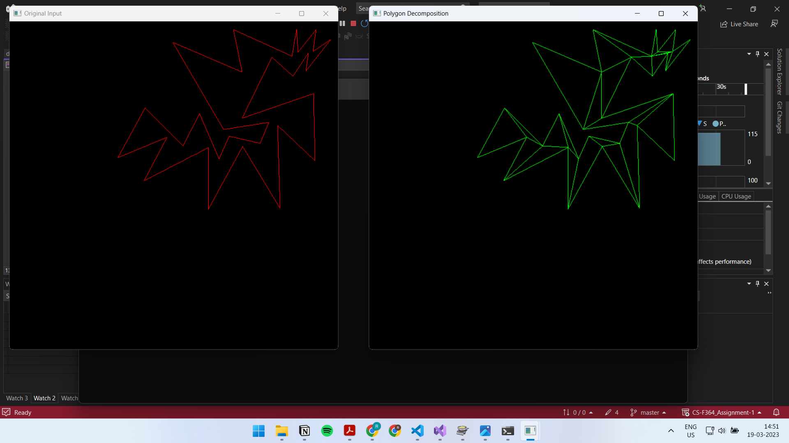

# Polygon Decomposition
J Fernandez, L Canovas, B Pelegrin  
Algorithms for the decomposition of a polygon into convex polygons,  
European Journal of Operational Research,  
Volume 121, Issue 2,  
2000,  
Pages 330-342,  
ISSN 0377-2217,  
https://doi.org/10.1016/S0377-2217(99)00033-8.  

## Build Instructions
- Tested on `Windows` using `Visual Studio` with `C++ Desktop Environment`
- freeglut library is statically linked for the visualizer to run
- all additional include directories and libraries can be found in the `dependencies` folder
- build the project with visual studio and press F5 to debug the application within visual studio itself
- first a blank window appears in which you are expected to draw a convex polygon with left clicks
- when you are done right click on the screen and then the polygon automatically closes
- after closing the polygon, you may exit the window
- now in a while, the input will be processed and the decomposed polygon is shown on the screen on a new window
- the output is also written to a text file

Here is a sample output from the application

## Testing
- I was able to test the algorithm on only small test cases with vertices from 20-30.
- The visualizer I had made it easy to test on various examples

## Design Discussion
- I faced some trouble for adding an edge into my DCEL data structure
- The way I traverse my polygon is by traversing the edges in in with the same incident face
- When I add an Edge, the face associations change due to addition of a new face and a removal of a part of the old
- because of this I was able to find that I was just looping through the same face and not able to go forward
- so I have decided to simply enumerate all the faceRecords in the DCEL in each iteration.
- each iteration may or may not add edges
- when in a complete iteration I don't find any new additions, I declare my decomposition complete and end my application